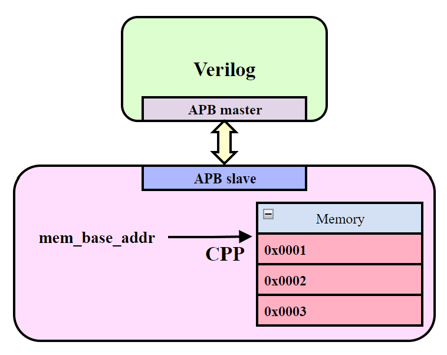

# APB_MEM
## 项目说明
1. 本项目是一个简单的、 APB 接口的虚拟存储器，通过与 APB Master 接口相连接，该存储器能够被正确地访存；
2. 该项目中 APB 的读写通道均能够设置固定的响应延迟（以系统时钟周期为单位）；该虚拟存储器能够被指定基地址，是否采用该基地址指定的存储器由注册的 uncached_read / uncached_write 的返回值决定，（如未注册则访问基地址指定的存储器）。

## 使用方法
1. 首先确定在您的设备上已经安装了 Verilator，Git；
2. apb_mem_demo.cpp 和 apb_demo.v 给出了一个简单的示例：
```cpp
    // step 0：包含头文件；
    #include "apb_mem.hpp"

    // step 1：初始化 Verilog 模块的仿真模型；
    top = new Vapb_demo;

    // step 2：定义一片虚拟的存储器区域；
    uint8_t mem[4096] = {0};

    // step 3：初始化一个 apb_mem 类（其中第一个模板参数为地址宽度对应的数据类型；第二个模板参数为数据宽度对应的数据类型）；
    apb_mem<uint32_t, uint32_t> apb_ports;

    // step 4：将apb_mem 类中的成员变量（与APB 信号相关的指针）与仿真模型的端口相绑定；
    apb_mem<uint32_t, uint32_t> apb_ports;
    apb_ports.pclk = &top->clk;
    apb_ports.presetn = &top->rstn;
    apb_ports.penable = &top->penable;
    apb_ports.pwrite = &top->pwrite;
    apb_ports.paddr = &top->paddr;
    apb_ports.psel = &top->psel;
    apb_ports.pwdata = &top->pwdata;
    apb_ports.pprot = &top->pprot;
    apb_ports.pstrb = &top->pstrb;
    apb_ports.prdata = &top->prdata;
    apb_ports.pready = &top->pready;
    apb_ports.pslverr = &top->pslverr;

    // step 5：调用类的 init 方法，指定 APB 接口各个通道的延迟、虚拟存储器的基地址、虚拟存储器对应的变量；基地址以下地址的读写函数指针；
    apb_ports.init(3, 3, 0x80000000, (uint8_t*)mem, NULL, NULL);
	
    
    ...

    // step 6：在仿真过程中，每次 eval 执行以后（!），调用类的 apb_signal_update 方法以更新 APB 信号。
    top->eval();
	apb_ports.apb_signal_update();


```
3. 如果需要将 APB 读写事务相关的信息通过标准输出显示，请在包含的头文件之前定义宏 APB_LOG：
```cpp
#define APB_LOG // print log about apb
#include "apb_mem.hpp"
```
4. 本项目中包含了一个简单的 Makefile，其选项有：
```shell
# 编译并运行，运行结果的 log 将被保存到 apb_mem.log，仿真导出的波形文件名为wave.vcd；
make 

# 通过 gtkwave （确定设备中已经安装该软件）查看波形文件；
make display

# 清理编译生成的所有文件；
make clean
```
## 项目结构


## TODO
1. 目前该项目并未实现 APB 的完整协议，如 pstrb 等，如有其他改进欢迎提交 PR 与 issue。
